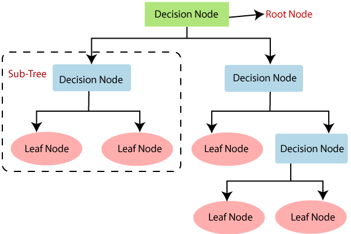
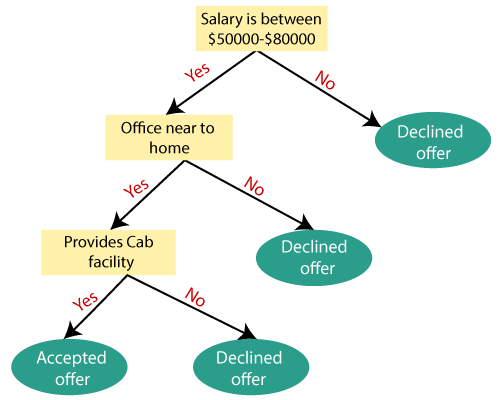

# Decision Tree
- A decision tree is a supervised learning algorithm that is used for both classification and regression, but majorly for classification. 
- It is a tree structured classifier 
- In a decision tree, the internal nodes depic the features of the provided dataset, the branches depict the decisions made and the leaf depicts the output which further will not be changed. 
- A decision tree is a graphical representation of all possible outcomes of the decisions/ features based on the provided conditions. 
- The decision tree algorithm works on the basis of the **CART** algorithm which stands for **Classification and Regression Tree** algorithm. 
- The decision tree performs its branching through decisions based on Yes or No answers. 
- A decision tree can contain categorical data (Y/N) or numerical data. 

# Decision Tree Terminologies:
**Root Node**: This is where the decision tree starts and it represents the whole dataset. The branching begins here, breaking the dataset into two homogenous parts.
**Leaf Node**: These are the output nodes of the tree where the final output of certain decisions or conditions is shown.
**Splitting**: It is the action of diving a node into sub nodes.
**Pruning**: It is the process of removing unwanted branches from the created tree.
**Branch/Sub-tree**: A branch or tree formed by splitting
**Parent/Child Node**: Root node is the parent node while all the others are child nodes.

# Decision Tree Working:
**Step-1**: Begin by creating the root node which consists/represents the whole dataset. 
**Step-2**: Then by using Attribute Selection Measures (ASM), select the best attributes. 
**Step-3**: Use these selected attributes to split the data and make decisions. 
**Step-4**: Based on the conditions provided along with the attributes, branch out the decision tree. 
**Step-5**: Kepp ite3ratins from step 3 and branching out the tree till the leaf node is achieved which implies that the data has converged. 
 Following image is an example for decision tree: 
 

# Attribute Selection Measures:
One of the key issues in implementing a decision tree is the selection of the best attributes fromn al the provided attributes. To solve this problem, we use the ASM. There are two key methods that are used for ASM. They are: 1. Information Gain 2. Ginni Index 

Before we dive into these two topics, let us leearn a few basic terminologies and their definitions.   Entropy: It is the measure of impurity or loss that occurs during Information Gain. It specifies the randomness of the data, specific to the attributes in the data. **Entropy(s)=-P(yes)log2 P(yes)- P(no) log2 P(no)** 
Here, s is the total number of samples and p(yes) is the probability of yes while p(no) is probability of no. 

# 1.Information Gain:
- It is the measure of the changes in the entropy of the provided attribute after segmentation.
- Information gain helps us analyse the most important attributews based on the information every feature provides which aids in the decision making.
- In a decision tree, the higher the information gain, the better the decision making for every attribute/node. 
**Information Gain= Entropy(S)- [(Weighted Avg) *Entropy(each feature)]**

# 2.Ginni Index:
- It is the measure of purity or impurity of the given attribute in the CART algorithm.
- Only the attributes with low ginni index must be  when compared to the higher ginni index attributes.
- CART uses Ginni Index for binary splitting.
**Gini Index= 1- ∑jPj2**

# Pruning in Decision Tree:
- Pruning is a process of deleting the unnecessary nodes from a tree in order to get the optimal decision tree.
- There are mainly two types of tree pruning technology used: Cost Complexity Pruning Reduced Error Pruning.