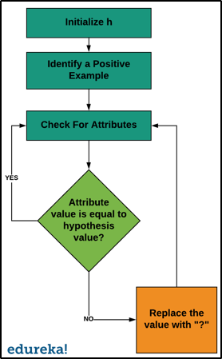

# Find S Learning Algorithm.
The find s algorithm also popularly known as the S algorithm is a concept learning algorithm and mainly consists of 3 vital parts.  1. Concept Learning  2. General Hypothesis  3. Specific Hypothesis 
# Concept Learning
If explained in human terms, we can identify certain given items based on their features. For example, we can differentiate a car from a truck based oon it's features like the height, the size of the wheels etc. These are nothing but features. Even machines can learn to differentiate them based on these features.  Features that define the provided data objects are knows as concepts. Any algorithm which learns based on the concepts requires the following : 1. Training Data 2. Target Concept 3. 3. Actual data objects. 
# General Hypothesis
General hypothesis is nothing but an explanation. It mainly explains the relations among major variables/objects. G={'?',...}  One example to explain the General Hypothesis could be the statement: ' I want a burger'.
# Specific Hypothesis
The specific hypothesis fills in details about the objects/ variables given in the general hypothesis.  An example for this could be :'I want a cheeseburger with jalapenos' 

- The Find S algorithm only uses positive examples and eliminates all negative examples. 
- The algorithm checks for the attribute value and compares it to the hypothesis value. If the values match, the algorithm moves on, if not it replaces the value to '?'. 

